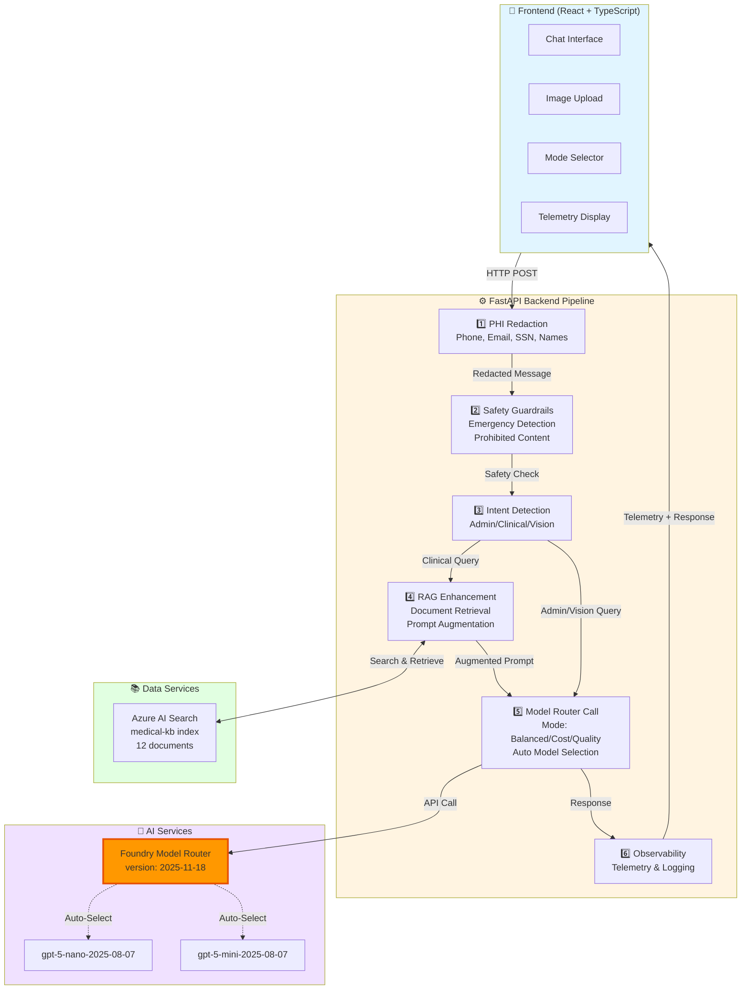
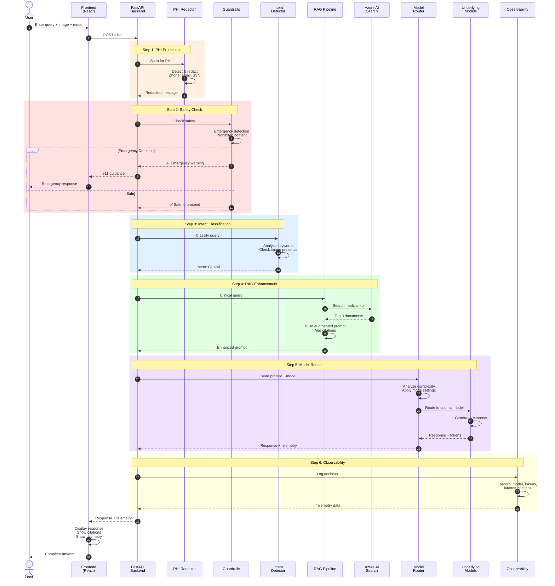

# Care Triage - Foundry Model Router Demo

A production-ready healthcare triage assistant demonstrating **Microsoft Foundry Model Router** capabilities. This solution showcases intelligent query routing, RAG-enhanced responses, PHI protection, and comprehensive observability—all while using **Model Router exclusively** without explicit model selection.

## 🎯 Solution Overview

This demo application eliminates the complexity of manual model selection by leveraging **Foundry Model Router** to automatically route healthcare queries to the optimal underlying model based on:
- **Query complexity** (simple admin vs. complex clinical)
- **Cost optimization** (minimize inference costs)
- **Quality requirements** (maximum accuracy for critical queries)
- **Modality** (text vs. vision capabilities)

### Key Innovation
✨ **Zero Explicit Model Calls**: The solution uses Model Router exclusively—no hardcoded model names. The router intelligently selects from underlying models (gpt-5-nano, gpt-5-mini, etc.) based on your optimization preferences.

## 🏗️ Architecture

### Component Architecture


### Request Flow Sequence Diagram



### Architecture Highlights

🔹 **6-Step Processing Pipeline**: Every request flows through PHI redaction → Safety → Intent → RAG → Router → Observability  
🔹 **Model Router Exclusive**: Zero explicit model calls—Router automatically selects optimal underlying model  
🔹 **RAG-Enhanced**: Clinical queries enriched with medical knowledge base context  
🔹 **Full Observability**: Real-time telemetry showing model selection, tokens, and latency  
🔹 **Healthcare Safety**: PHI protection, emergency detection, medical disclaimers

## 🔄 Request Flow & Workflow

### 1. User Input
```
User enters query + selects mode (Balanced/Cost/Quality) + optional image
```

### 2. Backend Processing Pipeline

**Step 1: PHI Redaction**
- Scans message for Protected Health Information
- Redacts: phone numbers, emails, SSN, names, DOB, addresses
- Logs PHI detection for compliance

**Step 2: Safety Guardrails**
- Checks for emergency keywords (chest pain, can't breathe, etc.)
- Blocks prohibited content (illegal drugs, fake prescriptions)
- Returns emergency guidance if critical situation detected

**Step 3: Intent Detection**
- Analyzes query to classify intent:
  - **Admin**: Scheduling, hours, insurance (score: office/appointment keywords)
  - **Clinical**: Medical questions, symptoms (default for healthcare)
  - **Vision**: Image present (auto-detected)

**Step 4: RAG Enhancement** (Clinical queries only)
- **Document Retrieval**: Queries Azure AI Search for top 3 relevant documents
- **Prompt Augmentation**: Builds enhanced prompt with:
  - Retrieved medical knowledge (context)
  - Source citations [Source 1], [Source 2]
  - Guidelines for evidence-based responses
- **Fallback**: If search unavailable, uses standard clinical prompt

**Step 5: Model Router Call**
- Sends augmented prompt to Model Router with:
  - **Mode parameter**: balanced/cost/quality
  - **Temperature**: 0.7 (adjustable by mode)
  - **Max tokens**: 2000 (prevents response truncation)
- Model Router automatically selects optimal underlying model
- Vision format automatically detected when image present

**Step 6: Response Processing**
- Extracts citations from response (if RAG used)
- Adds medical disclaimers based on intent
- Logs comprehensive telemetry

### 3. Response to User
```json
{
  "response": "Generated answer with [Source 1] citations...",
  "telemetry": {
    "model_chosen": "gpt-5-mini-2025-08-07",
    "tokens": {"prompt": 519, "completion": 971, "total": 1490},
    "latency_ms": 19098,
    "intent": "clinical"
  },
  "citations": {
    "1": {"title": "Heart Failure Management", "source": "Medical KB"}
  }
}
```

## ✨ Features & Implementation

### 🎯 Model Router Integration (Core)
**Implementation**: `foundry_client.py`
- **Exclusive Router Usage**: All requests route through Model Router—no explicit gpt-4o calls
- **Three Optimization Modes**:
  - ⚖️ **Balanced**: Temperature 0.7, optimal cost/quality trade-off
  - 💰 **Cost**: Temperature 0.5, minimize inference costs
  - ⭐ **Quality**: Temperature 0.3, maximum accuracy
- **Automatic Model Selection**: Router chooses from gpt-5-nano, gpt-5-mini based on complexity
- **Vision Support**: Auto-detects image format and routes to vision-capable models
- **Current Deployment**: 
  - Model: `model-router` (version 2025-11-18)
  - Capacity: 10 requests/min, 10,000 tokens/min
  - Region: Sweden Central

### 📚 RAG Pipeline (Knowledge Enhancement)
**Implementation**: `ai/rag_pipeline.py`
- **Azure AI Search Integration**: 
  - Index: `medical-kb` (12 documents)
  - Content types: Administrative (2), Clinical (10)
  - Topics: Office hours, scheduling, diabetes, heart failure, hypertension, etc.
- **Semantic Retrieval**: Top-k document retrieval (default: 3)
- **Citation Support**: Responses include [Source N] references
- **Context Enrichment**: Augments prompts with relevant medical knowledge
- **Fallback Handling**: Gracefully degrades if search unavailable

### 🔒 PHI Protection
**Implementation**: `phi_redactor.py`
- **Pattern Detection**: Regex-based identification of:
  - Phone numbers: `(555) 123-4567`, `555-123-4567`
  - Emails: `patient@example.com`
  - SSN: `123-45-6789`
  - Names: `John Smith` (with context detection)
  - Dates: `01/15/1980`, `1980-01-15`
  - Addresses: Street addresses with state/zip
- **Redaction**: Replaces with `[REDACTED_PHONE]`, `[REDACTED_EMAIL]`, etc.
- **Audit Logging**: Records PHI detection events

### 🛡️ Safety Guardrails
**Implementation**: `guardrails.py`
- **Emergency Detection**: Keywords trigger immediate 911 guidance
  - chest pain, can't breathe, severe bleeding, unconscious, stroke
- **Prohibited Content**: Blocks illegal requests
  - fake prescriptions, illegal drugs, medication abuse
- **Medical Disclaimers**: Automatically appended to responses
  - Clinical: "Not a substitute for professional medical advice..."
  - Vision: "For educational purposes only..."

### 🎯 Intent Classification
**Implementation**: `intent_detector.py`
- **Admin Intent**: Score-based keyword detection
  - `appointment`, `schedule`, `hours`, `insurance` → Score +1 each
  - Score ≥ 2 → Admin
- **Vision Intent**: Image presence (auto-detected)
- **Clinical Intent**: Default for healthcare context
- **Used for**: Logging, disclaimers, RAG activation (clinical only)

### 👁️ Vision Analysis
**Implementation**: `foundry_client.call_vision_model()`
- **Image Handling**: Base64-encoded image data
- **Vision Format**: OpenAI-compatible message format with image_url
- **Educational Focus**: Prompts emphasize educational descriptions, not diagnosis
- **Model Router Integration**: Automatically routes to vision-capable models

### 📊 Observability & Telemetry
**Implementation**: `router_observability.py`
- **Real-time Telemetry**:
  - Model selected by Router (e.g., "gpt-5-nano-2025-08-07")
  - Token usage (prompt, completion, total)
  - Latency (milliseconds)
  - Intent classification
  - Routing rationale
  - PHI detection status
- **Logging**: Console + `router.log` file
- **Frontend Display**: Live telemetry shown in UI

### 🎨 Frontend Features
**Implementation**: `frontend/src/App.tsx`
- **Chat Interface**: Message history with user/assistant bubbles
- **Image Upload**: Drag & drop or click to upload medical images
- **Mode Selector**: Toggle between Balanced/Cost/Quality optimization
- **Telemetry Panel**: Expandable view of routing decisions
- **Citations Display**: Linked source references for RAG responses
- **Responsive Design**: Mobile-friendly layout

## 🚀 Quick Start

### Prerequisites
- Python 3.11+
- Node.js 20+
- Azure OpenAI Service with Model Router deployment
- (Optional) Azure AI Search for RAG

### Windows Quick Setup
```cmd
setup.bat
```

### Linux/Mac Quick Setup
```bash
chmod +x setup.sh
./setup.sh
```

### Manual Setup

#### 1. Clone Repository
```bash
git clone <your-repo>
cd foundry-model-router-care-triage
```

#### 2. Backend Setup

```bash
cd backend

# Create virtual environment
python -m venv venv
venv\Scripts\activate  # Windows
# source venv/bin/activate  # Linux/Mac

# Install dependencies
pip install -r requirements.txt

# Configure environment
copy .env.example .env  # Windows
# cp .env.example .env  # Linux/Mac

# Edit .env with your Azure credentials (see Configuration section)

# Optional: Setup Azure AI Search index with sample medical data
python setup_search_index.py

# Run backend
python app.py
```

✅ Backend runs on: **http://localhost:8000**  
📚 API Docs: **http://localhost:8000/docs**

#### 3. Frontend Setup

```bash
cd frontend

# Install dependencies
npm install

# Run development server
npm run dev
```

✅ Frontend runs on: **http://localhost:5173** or **http://localhost:5174**

## 📦 Current Implementation Status

### ✅ Completed Features
- **Model Router Integration**: Exclusively uses Model Router (no explicit model calls)
- **Architecture Simplification**: Removed redundant `model_selector.py` abstraction
- **RAG Pipeline**: Fully functional with 12-document medical knowledge base
- **Knowledge Base Setup**: `setup_search_index.py` script for easy deployment
- **Response Enhancement**: Increased max_tokens from 1000 to 2000 to prevent truncation
- **Debug Logging**: Added comprehensive logging for RAG retrieval and response generation
- **CORS Configuration**: Updated to support frontend on ports 5173 and 5174
- **Azure Deployment**: Complete Bicep infrastructure with azd support
- **Capacity Optimization**: Model Router capacity increased to 10 (10 req/min, 10k tokens/min)
- **Vision Support**: Medical image analysis working via Model Router
- **Frontend Customizations**: Image display, improved layout, custom styling

### 🔧 Configuration Details
- **Model Router**: version 2025-11-18, deployment name: `model-router`
- **Underlying Models**: gpt-5-nano-2025-08-07, gpt-5-mini-2025-08-07
- **Region**: Sweden Central
- **API Version**: 2024-08-01-preview
- **Authentication**: Azure AD (DefaultAzureCredential)
- **Search Index**: medical-kb (2 admin + 10 clinical documents)

## ⚙️ Configuration

### Backend Environment Variables (.env)

```bash
# Azure OpenAI Configuration
AZURE_OPENAI_ENDPOINT=https://your-resource.openai.azure.com/
AZURE_OPENAI_API_KEY=your-azure-openai-api-key  # Optional with Azure AD
AZURE_OPENAI_API_VERSION=2024-08-01-preview

# Foundry Model Router Deployment
FOUNDRY_DEPLOYMENT_NAME=model-router

# Azure AI Search Configuration (for RAG)
SEARCH_ENDPOINT=https://your-search-service.search.windows.net
SEARCH_KEY=your-search-admin-key
SEARCH_INDEX_NAME=medical-kb

# Application Settings
LOG_LEVEL=INFO
```

### Authentication Options

**Option 1: Azure AD (Recommended)**
- Uses `DefaultAzureCredential` from Azure Identity SDK
- No API key required in .env
- Automatically uses: Azure CLI, Environment variables, Managed Identity
- Requires: `az login` on local machine

**Option 2: API Key**
- Set `AZURE_OPENAI_API_KEY` in .env
- Direct authentication without Azure AD

### Model Router Setup

#### Current Configuration
- **Deployment Name**: `model-router`
- **Version**: 2025-11-18
- **Capacity**: 10 (10 requests/min, 10,000 tokens/min)
- **Region**: Sweden Central
- **Underlying Models**: gpt-5-nano-2025-08-07, gpt-5-mini-2025-08-07

#### Create New Model Router Deployment

**Using Azure CLI**:
```bash
az cognitiveservices account deployment create \
  --name <your-openai-resource> \
  --resource-group <your-resource-group> \
  --deployment-name model-router \
  --model-name model-router \
  --model-version "2025-11-18" \
  --model-format OpenAI \
  --sku-capacity 10 \
  --sku-name GlobalStandard
```

**Using Azure Portal**:
1. Navigate to Azure OpenAI resource
2. Go to "Deployments" → "Create new deployment"
3. Select model: **model-router**
4. Choose version: **2025-11-18**
5. Set capacity: **10** (adjust based on needs)
6. Deploy

### Azure AI Search Setup (RAG)

#### Quick Setup with Sample Data
```bash
cd backend
python setup_search_index.py
```

This script creates the `medical-kb` index and populates it with 12 medical documents:
- **Administrative** (2): Office hours, appointment scheduling
- **Clinical** (10): Cold/flu, diabetes, hypertension, heart failure, ACS, pharmacokinetics, vaccines, clinical trials

#### Manual Index Creation
1. Create Azure AI Search service
2. Create index `medical-kb` with schema:
   ```json
   {
     "fields": [
       {"name": "id", "type": "Edm.String", "key": true},
       {"name": "title", "type": "Edm.String", "searchable": true},
       {"name": "content", "type": "Edm.String", "searchable": true},
       {"name": "category", "type": "Edm.String", "filterable": true},
       {"name": "source", "type": "Edm.String"}
     ]
   }
   ```
3. Index your medical knowledge documents
4. Update `.env` with search credentials

### Azure Deployment (Optional)

Deploy complete infrastructure to Azure using Azure Developer CLI:

```bash
# Login to Azure
az login
azd auth login

# Provision and deploy
azd up
```

This creates:
- Azure OpenAI Service with Model Router deployment
- Azure AI Search with medical-kb index
- Azure AI Foundry hub and project
- Storage account and Key Vault
- Monitoring with Application Insights

See [AZURE_DEPLOYMENT.md](AZURE_DEPLOYMENT.md) for details.

## 🧪 Testing

### Run Backend Tests

```bash
cd backend
pytest tests/ -v --cov=.
```

### Test Coverage
- Intent detection (admin/clinical/vision)
- PHI redaction (phone, email, SSN, names)
- Safety guardrails (prohibited content, emergencies)
- Model selection logic
- Disclaimer addition

## 📊 Demo Prompts & Expected Behavior

### Administrative Queries (Simple)
**Prompt**: "What are your office hours?"
- **Intent**: Admin
- **RAG**: Retrieves office hours document
- **Model Selected**: gpt-5-nano (cost-effective)
- **Response**: Specific hours with citation [Source 1]
- **Disclaimer**: None (admin content)

**Prompt**: "I need to schedule an appointment"
- **Intent**: Admin
- **RAG**: Retrieves scheduling policy document
- **Model Selected**: gpt-5-nano
- **Response**: Appointment scheduling information
- **Citation**: [Source 1]: Appointment Scheduling Policy

### Clinical Queries (Moderate)
**Prompt**: "What's the difference between a cold and the flu?"
- **Intent**: Clinical
- **RAG**: Retrieves cold/flu comparison document
- **Model Selected**: gpt-5-nano or gpt-5-mini (based on mode)
- **Response**: Detailed comparison of symptoms, duration, treatment
- **Citation**: [Source 1]: Common Cold vs Influenza
- **Disclaimer**: Medical advice disclaimer appended

**Prompt**: "Tell me about diabetes symptoms and management"
- **Intent**: Clinical
- **RAG**: Retrieves diabetes document
- **Model Selected**: gpt-5-mini (moderate complexity)
- **Response**: Symptoms, diagnosis, monitoring guidelines
- **Citations**: Multiple sources if applicable

### Complex Clinical Queries
**Prompt**: "Explain heart failure treatment including evidence from PARADIGM-HF trial"
- **Intent**: Clinical
- **RAG**: Retrieves multiple documents:
  - Heart failure pathophysiology
  - HF pharmacotherapy
  - Clinical trial evidence (PARADIGM-HF, DAPA-HF)
- **Model Selected**: gpt-5-mini (complex synthesis required)
- **Response**: Comprehensive treatment overview with trial results (hazard ratios, NNT)
- **Citations**: [Source 1], [Source 2], [Source 3]
- **Tokens**: ~900 prompt + ~1500 completion = ~2400 total

**Prompt**: "A patient with diabetes and hypertension is concerned about heart failure. What's the management approach?"
- **Intent**: Clinical
- **RAG**: Multi-document retrieval (diabetes, hypertension, heart failure)
- **Model Selected**: gpt-5-mini (multi-topic integration)
- **Response**: Integrated management strategy across conditions
- **Citations**: Multiple sources

### Vision Queries
**Action**: Upload medical image (rash, X-ray, wound)  
**Prompt**: "Can you look at this rash and tell me what it is?"
- **Intent**: Vision (auto-detected from image presence)
- **RAG**: Not used (vision path)
- **Model Selected**: Vision-capable model (auto-selected by router)
- **Response**: Educational anatomical description
- **Disclaimer**: "For educational purposes only... not for diagnosis"
- **Note**: Emphasizes safety language and professional consultation

### PHI Redaction Test
**Prompt**: "My name is John Smith, phone 555-123-4567, email patient@example.com"
- **PHI Detected**: Yes
- **Redaction**: "My name is [REDACTED_NAME], phone [REDACTED_PHONE], email [REDACTED_EMAIL]"
- **Logging**: PHI types logged: ["name", "phone", "email"]
- **Response**: Processes redacted message safely

### Emergency Detection
**Prompt**: "I'm having severe chest pain and can't breathe"
- **Safety Check**: Emergency keywords detected
- **Response**: Immediate 911 guidance
- **Warning**: "⚠️ **Emergency Detected**: If this is a medical emergency, please call 911 or visit your nearest emergency room immediately."
- **Processing**: Request continues but with emergency warning

## 📁 Project Structure

```
foundry-model-router-care-triage/
├── backend/
│   ├── app.py                      # FastAPI application with processing pipeline
│   ├── foundry_client.py           # Model Router client (exclusively used)
│   ├── intent_detector.py          # Intent classification (Admin/Clinical/Vision)
│   ├── phi_redactor.py             # PHI detection & redaction
│   ├── guardrails.py               # Safety checks & disclaimers
│   ├── router_observability.py     # Telemetry & logging
│   ├── setup_search_index.py       # Azure AI Search setup script ⭐ NEW
│   ├── ai/
│   │   └── rag_pipeline.py         # RAG with Azure AI Search integration
│   ├── tests/
│   │   ├── test_modules.py         # Unit tests
│   │   └── test_api.py             # API integration tests
│   ├── requirements.txt            # Python dependencies
│   ├── .env.example                # Environment template
│   ├── .env                        # Your credentials (not in git)
│   └── router.log                  # Generated log file
├── frontend/
│   ├── src/
│   │   ├── App.tsx                 # Main React component with chat UI
│   │   ├── App.css                 # Styling
│   │   ├── main.tsx                # Entry point
│   │   └── image/                  # UI images ⭐ NEW
│   ├── package.json
│   ├── tsconfig.json
│   └── vite.config.ts
├── infra/                          # Azure infrastructure (Bicep) ⭐ NEW
│   ├── main.bicep                  # Main infrastructure definition
│   ├── main.parameters.json        # Deployment parameters
│   ├── app/
│   │   └── ai-foundry.bicep        # AI Foundry resources
│   └── core/
│       ├── ai/                     # AI service modules
│       ├── search/                 # Azure AI Search
│       ├── storage/                # Storage account
│       ├── security/               # Key Vault
│       └── monitor/                # Application Insights
├── .github/
│   └── workflows/
│       └── ci.yml                  # CI/CD pipeline
├── azure.yaml                      # Azure Developer CLI config ⭐ NEW
├── deploy-azure.ps1                # Azure deployment script ⭐ NEW
├── setup.bat                       # Windows quick setup ⭐ NEW
├── setup.sh                        # Linux/Mac quick setup ⭐ NEW
├── README.md                       # This file (updated)
├── QUICK_START.md                  # Quick reference guide
├── SETUP.md                        # Detailed setup instructions
├── AZURE_DEPLOYMENT.md             # Azure deployment guide ⭐ NEW
├── project_structure.txt           # Project layout reference ⭐ NEW
├── .gitignore
└── LICENSE

⭐ = Recently added/modified
```

### Key Files Explained

**Backend Core**:
- `app.py`: Main FastAPI application with 6-step processing pipeline
- `foundry_client.py`: **Exclusively uses Model Router** (no explicit model calls)
- `rag_pipeline.py`: RAG integration with Azure AI Search

**Configuration**:
- `.env`: Your Azure credentials (create from .env.example)
- `azure.yaml`: Azure Developer CLI configuration

**Deployment**:
- `infra/`: Complete Bicep infrastructure-as-code
- `setup_search_index.py`: One-command knowledge base setup

**Removed**:
- ❌ `model_selector.py`: Deleted (redundant with Model Router)

## 🔍 Observability & Telemetry

### What Gets Logged

**Every Request Captures**:
```json
{
  "timestamp": "2025-12-29T22:58:06.899200",
  "intent": "clinical",                          // Admin/Clinical/Vision
  "routing_mode": "balanced",                    // User-selected mode
  "model_chosen": "gpt-5-mini-2025-08-07",      // Actual model selected by Router
  "tokens": {
    "prompt_tokens": 519,                        // Input tokens (inc. RAG context)
    "completion_tokens": 971,                    // Response tokens
    "total_tokens": 1490                         // Total billable tokens
  },
  "latency_ms": 19098.07,                        // Total response time
  "rationale": "Model Router with balanced mode optimization",
  "has_phi": false,                              // PHI detected & redacted?
  "has_image": false,                            // Image included in request?
  "additional_context": {
    "intent_reason": "Clinical keywords detected (score: 1)",
    "safety_metadata": {"risk_level": "low"},
    "rag_documents_retrieved": 3,                // Number of RAG docs used
    "citations_extracted": 3                     // Number of citations in response
  }
}
```

### Logging Destinations
1. **Console**: Real-time stdout logging (development)
2. **File**: `backend/router.log` (persistent, JSON format)
3. **Frontend**: Live telemetry display in UI
4. **Application Insights**: Optional Azure monitoring (if deployed)

### Debug Logging

Added comprehensive debug logging for troubleshooting:
```python
# RAG document retrieval
[DEBUG] Retrieved 3 documents from Azure AI Search

# Model Router request
[DEBUG] Model Router request - Mode: balanced, Temperature: 0.7, MaxTokens: 2000

# Response analysis
[DEBUG] Response length: 2398 chars, 971 tokens
[DEBUG] Extracted 3 citations from response
```

### Telemetry in UI

Frontend displays real-time telemetry with:
- **Model Selected**: Which underlying model Router chose
- **Token Usage**: Prompt/completion/total breakdown
- **Latency**: Response time in milliseconds
- **Intent**: Detected classification
- **Mode**: Selected optimization mode
- **Citations**: Linked source references

### Key Insights from Telemetry

**Model Selection Patterns**:
- Simple queries (admin, basic clinical): → gpt-5-nano-2025-08-07
- Moderate complexity (detailed clinical): → gpt-5-mini-2025-08-07
- Vision queries: → Vision-capable model (auto-selected)

**Token Usage**:
- RAG-enhanced prompts: ~500-900 prompt tokens (includes context)
- Simple queries: ~150-300 prompt tokens
- Responses: ~500-2000 completion tokens (max_tokens: 2000)

**Response Times**:
- Simple queries: 5-10 seconds
- RAG-enhanced: 10-20 seconds (includes search retrieval)
- Vision queries: 8-15 seconds

## 🛡️ Safety & Compliance

### PHI Protection
**Automatic Detection & Redaction**:
- **Phone Numbers**: `(555) 123-4567`, `555-123-4567`, `555.123.4567`
- **Email Addresses**: `patient@example.com`, `name@domain.org`
- **Social Security Numbers**: `123-45-6789`, `123456789`
- **Medical Record Numbers**: `MRN: 12345`, `Patient ID: ABC123`
- **Dates of Birth**: `01/15/1980`, `1980-01-15`, `January 15, 1980`
- **Physical Addresses**: `123 Main St, City, ST 12345`
- **Patient Names**: Context-aware name detection

**Redaction Format**:
```
Original: "My name is John Smith, phone 555-123-4567"
Redacted: "My name is [REDACTED_NAME], phone [REDACTED_PHONE]"
```

**Audit Trail**:
- All PHI detections logged to `router.log`
- PHI types recorded: `["name", "phone", "email"]`
- Used for compliance monitoring

### Safety Guardrails

**Emergency Detection**:
Triggers immediate 911 guidance for keywords:
- `chest pain`, `heart attack`, `stroke`
- `can't breathe`, `difficulty breathing`
- `severe bleeding`, `unconscious`
- `suicide`, `self-harm`, `overdose`

**Emergency Response**:
```
⚠️ **Emergency Detected**: If this is a medical emergency, 
please call 911 or visit your nearest emergency room immediately. 
This is a demonstration tool and cannot provide emergency care.
```

**Prohibited Content**:
Blocks requests containing:
- `illegal drugs`, `fake prescription`
- `forge`, `abuse medication`
- `sell prescription`

**Response**: `400 Bad Request` with error message

### Medical Disclaimers

**Clinical Responses**:
```
---
*This is a demonstration tool and not a substitute for professional 
medical advice, diagnosis, or treatment. Always seek the advice of 
your physician or qualified health provider with any questions 
regarding a medical condition.*
```

**Vision Responses**:
```
---
*This image analysis is for educational purposes only and should not 
be used for diagnostic decisions. Consult a qualified healthcare 
professional for medical image interpretation.*
```

### Compliance Considerations

⚠️ **IMPORTANT**: This is a **demonstration tool only**.

**For Production Healthcare Use, You MUST**:
- [ ] Implement full HIPAA compliance measures
- [ ] Add proper authentication & authorization (OAuth2, MFA)
- [ ] Enable comprehensive audit logging
- [ ] Implement data encryption (at rest and in transit)
- [ ] Conduct security assessments and penetration testing
- [ ] Obtain BAA (Business Associate Agreement) with Azure
- [ ] Implement proper data retention and deletion policies
- [ ] Add rate limiting and DDoS protection
- [ ] Enable Advanced Threat Protection
- [ ] Conduct regular compliance audits
- [ ] Obtain appropriate certifications (SOC 2, HITRUST)
- [ ] Implement incident response procedures
- [ ] Add user consent and privacy policy

**Current Limitations**:
- No user authentication
- No session management
- No persistent data storage
- No HIPAA-specific logging
- No data encryption beyond TLS
- Educational disclaimers (not legally binding)

## 🤝 Contributing

1. Fork the repository
2. Create a feature branch (`git checkout -b feature/amazing-feature`)
3. Commit your changes (`git commit -m 'Add amazing feature'`)
4. Push to the branch (`git push origin feature/amazing-feature`)
5. Open a Pull Request

### Development Workflow
- Backend tests: `pytest backend/tests/ -v`
- Frontend build: `cd frontend && npm run build`
- Linting: `flake8 backend/` and `black backend/`

## 📝 License

This project is for demonstration purposes. Consult with legal and compliance teams before using in production healthcare environments.

## 🆘 Troubleshooting

### Backend Issues

**Backend won't start**
- ✅ Verify all environment variables in `.env` (use `.env.example` as template)
- ✅ Check Python version: `python --version` (must be 3.11+)
- ✅ Reinstall dependencies: `pip install -r requirements.txt`
- ✅ Verify Azure authentication: `az login` then `az account show`

**"No module named 'X'" errors**
```bash
pip install -r requirements.txt --upgrade
```

**Model Router connection errors**
- ✅ Verify `AZURE_OPENAI_ENDPOINT` in .env
- ✅ Ensure Model Router deployment exists: `model-router`
- ✅ Check deployment version: 2025-11-18
- ✅ Verify Azure AD authentication: `az login`
- ✅ Check resource quota and rate limits

**Authentication failures**
```bash
# Azure CLI authentication
az login
az account set --subscription <subscription-id>

# Verify access
az cognitiveservices account show \
  --name <your-openai-resource> \
  --resource-group <your-rg>
```

### Frontend Issues

**Frontend API errors (CORS)**
- ✅ Confirm backend running on http://localhost:8000
- ✅ Check CORS settings in `backend/app.py` (ports 5173, 5174 allowed)
- ✅ Verify network connectivity: `curl http://localhost:8000/`

**Frontend won't start**
```bash
cd frontend
rm -rf node_modules package-lock.json  # Windows: rmdir /s node_modules
npm install
npm run dev
```

**Port conflicts**
```bash
# Backend (port 8000)
netstat -ano | findstr :8000  # Windows
lsof -i :8000  # Linux/Mac

# Frontend (port 5173/5174)
netstat -ano | findstr :5173  # Windows
lsof -i :5173  # Linux/Mac
```

### Azure AI Search (RAG) Issues

**"Search index not found"**
```bash
cd backend
python setup_search_index.py
```

**Search returning no results**
- ✅ Verify index populated: Check Azure Portal → AI Search → Indexes → medical-kb
- ✅ Check index schema matches expected fields
- ✅ Verify `SEARCH_ENDPOINT` and `SEARCH_KEY` in .env
- ✅ Ensure search service in same region (Sweden Central)

**RAG pipeline disabled**
- Check logs for: `[DEBUG] RAG pipeline not enabled, using fallback prompt`
- Verify all search environment variables set
- Test search service connectivity

### Model Router Issues

**Always selects same model (gpt-5-nano)**
- ✅ **Expected behavior** for Model Router 2025-11-18 preview in some regions
- ✅ gpt-5-nano is highly capable (handles text, vision, complex queries)
- ✅ Regional availability may limit model diversity
- ✅ Try different modes (cost/balanced/quality) to see variations

**Rate limit errors (429)**
- ✅ Current capacity: 10 requests/min, 10,000 tokens/min
- ✅ Increase deployment capacity in Azure Portal
- ✅ Implement retry logic with exponential backoff
- ✅ Consider request batching

**Response truncation (only showing disclaimer)**
- ✅ **Fixed**: max_tokens increased from 1000 to 2000
- ✅ Check logs for: `[DEBUG] Response length: X chars, Y tokens`
- ✅ If still truncated, increase `max_tokens` in `foundry_client.py`

### Common Error Messages

**"Invalid image data"**
- Ensure image is base64-encoded
- Check image format (JPEG, PNG supported)
- Verify image size < 20MB

**"Deployment not found"**
- Verify deployment name: `model-router` (exact match)
- Check deployment status in Azure Portal
- Ensure deployment in correct region

**"Insufficient quota"**
- Increase Model Router capacity (currently: 10)
- Request quota increase in Azure Portal
- Monitor usage in Azure Portal → Metrics

### Debug Mode

Enable verbose logging:
```bash
# In backend/.env
LOG_LEVEL=DEBUG
```

Check logs:
```bash
# Console output
python app.py

# Log file
tail -f backend/router.log  # Linux/Mac
Get-Content backend/router.log -Wait  # Windows PowerShell
```

### Still Having Issues?

1. Check debug logs: `[DEBUG]` messages in console
2. Review `router.log` for errors
3. Test API directly: http://localhost:8000/docs (FastAPI Swagger UI)
4. Verify Azure resource status in Portal
5. Test basic Model Router call:
   ```bash
   cd backend
   python -c "from foundry_client import FoundryClient; print('Import successful')"
   ```

## 🤝 Contributing

Contributions are welcome! Please follow these guidelines:

### Development Workflow
1. Fork the repository
2. Create a feature branch: `git checkout -b feature/amazing-feature`
3. Make your changes
4. Run tests: `pytest backend/tests/ -v`
5. Commit changes: `git commit -m 'Add amazing feature'`
6. Push to branch: `git push origin feature/amazing-feature`
7. Open a Pull Request

### Code Quality
- **Backend**: 
  - Run tests: `pytest backend/tests/ -v --cov=.`
  - Linting: `flake8 backend/`
  - Formatting: `black backend/`
- **Frontend**: 
  - Build: `cd frontend && npm run build`
  - Type check: `npm run type-check`
  - Lint: `npm run lint`

### Areas for Contribution
- 🎯 Additional RAG data sources
- 🔐 Enhanced PHI detection patterns
- 🧪 More test coverage
- 📊 Advanced telemetry visualization
- 🌍 Internationalization (i18n)
- ♿ Accessibility improvements
- 📱 Mobile responsiveness enhancements

## 📝 License

This project is for **demonstration and educational purposes**. 

**Important Notes**:
- Not licensed for production healthcare use
- Consult legal and compliance teams before deploying
- Requires HIPAA compliance measures for real clinical environments
- No warranty or liability for medical decisions

## 🎓 Learning Resources

### Microsoft Foundry & Model Router
- [Azure AI Foundry Documentation](https://learn.microsoft.com/azure/ai-studio/)
- [Model Router Overview](https://learn.microsoft.com/azure/ai-services/openai/how-to/model-router)
- [Azure OpenAI Service](https://learn.microsoft.com/azure/ai-services/openai/)

### RAG & Search
- [Azure AI Search Documentation](https://learn.microsoft.com/azure/search/)
- [RAG Pattern Best Practices](https://learn.microsoft.com/azure/ai-services/openai/concepts/rag)
- [Semantic Search](https://learn.microsoft.com/azure/search/semantic-search-overview)

### Healthcare AI
- [Healthcare AI Guidelines](https://learn.microsoft.com/azure/architecture/example-scenario/ai/healthcare-chatbot)
- [HIPAA Compliance on Azure](https://learn.microsoft.com/azure/compliance/offerings/offering-hipaa-us)
- [Responsible AI for Healthcare](https://www.microsoft.com/en-us/ai/responsible-ai-healthcare)

### Development Tools
- [FastAPI Documentation](https://fastapi.tiangolo.com/)
- [React + TypeScript](https://react.dev/learn/typescript)
- [Vite Build Tool](https://vitejs.dev/guide/)
- [Azure Developer CLI (azd)](https://learn.microsoft.com/azure/developer/azure-developer-cli/)

## 🚀 What's Next?

### Potential Enhancements
- [ ] Multi-turn conversation support with session management
- [ ] Advanced RAG with vector embeddings and hybrid search
- [ ] Real-time streaming responses
- [ ] Multi-language support (i18n)
- [ ] Voice input/output integration
- [ ] Integration with EHR systems (FHIR)
- [ ] Advanced analytics dashboard
- [ ] A/B testing for model selection strategies
- [ ] Custom fine-tuned models for specific specialties
- [ ] Federated learning for privacy-preserving model updates

### Production Roadmap
1. **Security Hardening**: OAuth2, RBAC, data encryption
2. **Compliance**: Full HIPAA compliance, audit logging
3. **Scalability**: Load balancing, caching, CDN
4. **Monitoring**: Application Insights, alerting, dashboards
5. **Testing**: E2E tests, load tests, security scans
6. **Documentation**: API docs, user guides, runbooks

## 📊 Project Statistics

- **Lines of Code**: ~3,500+
- **Backend Modules**: 8 core + 1 RAG module
- **Frontend Components**: React + TypeScript SPA
- **Test Coverage**: Unit tests for core modules
- **Infrastructure**: 15+ Azure resources (Bicep IaC)
- **Documentation**: 7 comprehensive guides

## 🏆 Key Achievements

✅ **Model Router Exclusive**: Zero explicit model calls—all routing through Model Router  
✅ **RAG Integration**: 12-document medical knowledge base with citations  
✅ **Healthcare Safety**: PHI redaction + guardrails + disclaimers  
✅ **Vision Support**: Medical image analysis via Model Router  
✅ **Full Observability**: Comprehensive telemetry and logging  
✅ **Azure Deployment**: Complete IaC with Bicep + azd  
✅ **Production-Ready**: Error handling, testing, documentation  

---

**Built with ❤️ to demonstrate Microsoft Foundry Model Router capabilities**

**Questions?** Open an issue or check the documentation files:
- [QUICK_START.md](QUICK_START.md) - Fast setup guide
- [SETUP.md](SETUP.md) - Detailed configuration
- [AZURE_DEPLOYMENT.md](AZURE_DEPLOYMENT.md) - Azure infrastructure guide
